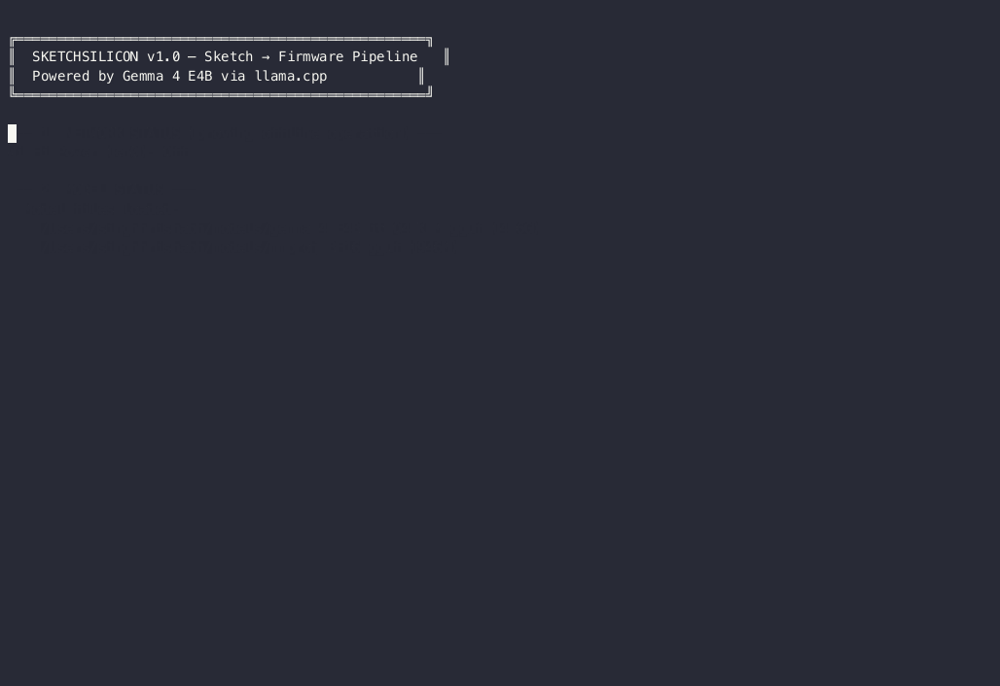

# SketchSilicon

```
███████╗██╗███████╗██╗     ██████╗ ███████╗ ██████╗ ██████╗  ██████╗ ███████╗
██╔════╝██║██╔════╝██║     ██╔══██╗██╔════╝██╔═══██╗██╔══██╗██╔════╝ ██╔════╝
█████╗  ██║█████╗  ██║     ██║  ██║█████╗  ██║   ██║██████╔╝██║  ███╗█████╗
██╔══╝  ██║██╔══╝  ██║     ██║  ██║██╔══╝  ██║   ██║██╔══██╗██║   ██║██╔══╝
██║     ██║███████╗███████╗██████╔╝██║     ╚██████╔╝██║  ██║╚██████╔╝███████╗
╚═╝     ╚═╝╚══════╝╚══════╝╚═════╝ ╚═╝      ╚═════╝ ╚═╝  ╚═╝ ╚═════╝ ╚══════╝
```

**Sketch it. Snap it. Flash it.** — Turn a photo of any hand-drawn circuit schematic into validated, compiled, running ARM firmware. Entirely offline. On a phone. In under 2 minutes.



    

---

## The Story

It's 3 AM in a flood-damaged hospital. The water pump that keeps the dialysis unit running has failed — its control board is fried. The field engineer knows exactly what circuit she needs. She sketches it on the back of a patient chart. But there's no laptop, no internet, no IDE. Just a phone in her pocket.

**SketchSilicon turns that sketch into working firmware in under 2 minutes — completely offline.**

## Quick Start

```bash
git clone https://github.com/singhhrishabh/SketchSilicon.git
cd sketchsilicon
pip install -r requirements.txt
chmod +x setup.sh start_server.sh
./setup.sh                    # Install ARM GCC, llama.cpp, download Gemma 4
./start_server.sh             # Start local AI server
python -m ui.cli demo         # Run the demo!
```

## Architecture

```
┌──────────────────────────────────────────────────────────────────┐
│                    SketchSilicon Pipeline                           │
│                                                                  │
│  📷 Phone Photo                                                  │
│       │                                                          │
│       ▼                                                          │
│  ┌─────────────────┐    OpenCV: CLAHE, bilateral filter,         │
│  │ Image Processor  │    Otsu threshold, Hough deskew            │
│  └────────┬────────┘                                             │
│           │ base64 PNG                                           │
│           ▼                                                      │
│  ┌─────────────────┐    Gemma 4 E4B (multimodal)                │
│  │ Architect Agent  │───▶ Reads schematic → generates C code    │
│  └────────┬────────┘    Uses function calling to trigger GCC     │
│           │ C source                                             │
│           ▼                                                      │
│  ┌─────────────────┐    arm-none-eabi-gcc -mcpu=cortex-m0       │
│  │  GCC Compiler    │───▶ Compiles to ARM ELF binary            │
│  └────────┬────────┘    Self-healing: fix errors, retry (×2)     │
│           │ compiled binary                                      │
│           ▼                                                      │
│  ┌─────────────────┐    Gemma 4 E4B (text)                      │
│  │  Critic Agent    │───▶ Line-by-line bug review                │
│  └────────┬────────┘    Catches: null ptrs, buffer overflows,    │
│           │              missing volatile, wrong bit masks        │
│           ▼                                                      │
│  ┌─────────────────┐    Recompile with fixes                    │
│  │ Final Compile    │───▶ arm-none-eabi-size metrics             │
│  └────────┬────────┘                                             │
│           │                                                      │
│     ┌─────┴─────┐                                                │
│     ▼           ▼                                                │
│  ┌──────┐  ┌──────────┐                                         │
│  │ QEMU │  │ Scorer    │ instruction count, binary size,         │
│  │ ARM  │  │ (A/B/C/F) │ stack depth → weighted grade            │
│  └──────┘  └──────────┘                                         │
│                                                                  │
│  Output: firmware.elf + resource report + bug-fix diff           │
└──────────────────────────────────────────────────────────────────┘
```

## How Gemma 4's Unique Features Are Used

### 🔍 Multimodal Vision
Gemma 4 E4B reads the **actual hand-drawn schematic photo** — not typed text or a clean diagram. It identifies resistors, LEDs, MCU pins, transistors, and wiring from pen-on-paper drawings, then maps them to GPIO configurations.

### 🔧 Native Function Calling
The Architect agent uses Gemma 4's built-in tool-use to **call the GCC compiler directly** when code is ready. No regex parsing of "I'm done" — the model invokes `compile_firmware(code=...)` as a structured function call.

### 📝 Long Context Window
The Critic agent holds the **entire firmware source** in context (typically 80–150 lines) while performing a 15-point safety review. No chunking, no summarization — the full code is reviewed in a single pass.

## Why This Is Real, Not a Demo Trick

1. **GCC is real.** The firmware compiles with `arm-none-eabi-gcc` — the same compiler used in production embedded systems. Every error and metric comes from actual GCC output.

2. **The bug-catch is real.** The Critic agent finds genuine bugs (uninitialized pointers, missing `volatile` keywords, wrong clock enables) that would cause actual crashes on ARM hardware.

3. **The simulation is real.** The compiled ELF runs in QEMU ARM emulator. If the firmware has a logic error, it fails in the simulator.

4. **The metrics are real.** Instruction count, binary size, and stack depth come from `arm-none-eabi-size` and `arm-none-eabi-objdump` — standard toolchain utilities.

## Running Offline (Cactus Track)

SketchSilicon requires **zero internet** after initial setup:

```bash
# 1. Setup (one-time, needs internet)
./setup.sh

# 2. Disable WiFi
networksetup -setairportpower en0 off   # macOS
# or: nmcli radio wifi off              # Linux

# 3. Start server (local model, no network)
./start_server.sh

# 4. Run pipeline (fully offline)
python -m ui.cli run --offline-demo tests/sample_schematics/led_blink.png
```

Screenshot your WiFi-off notification for the submission.

## llama.cpp Deployment

```bash
# Model: Gemma 4 E4B Instruct (unsloth/gemma-4-E4B-it-GGUF), Q4_K_M quantization
# Path: ~/models/gemma-4-E4B-it-Q4_K_M.gguf
# Server: llama.cpp OpenAI-compatible API

./start_server.sh
# → Gemma 4 E4B — ONLINE via llama.cpp
# → Endpoint: http://localhost:8080
# → Mode: OFFLINE (no internet needed)

# Typical performance:
# M2 MacBook Air: ~18 tokens/sec
# RTX 3080:       ~45 tokens/sec
# Android (SD 8 Gen 2): ~8 tokens/sec
```

## Sample Output

```
SKETCHSILICON v1.0 │ Powered by Gemma 4 via llama.cpp
  Server: ONLINE ✓
  Network: OFFLINE MODE ✓

Step 1/7 — Image preprocessed ✓
  Components: 1 │ Complexity: simple │ Size: 1024×887px
Step 2/7 — Firmware generated ✓
  Generated: 124 lines of C
  Tool called: compile_firmware
Step 3/7 — Self-healed on attempt 1 ✓
Step 4/7 — Critic review complete ✓
  Verdict: FAIL │ Issues: 10 │ Confidence: 100%
  ┌──────┬──────┬────────────────────────────────────────────┐
  │ Line │ Sev  │ Description                                │
  ├──────┼──────┼────────────────────────────────────────────┤
  │   15 │ CRIT │ RCC_AHBENR uses reg() — returns volatile*  │
  │   48 │ CRIT │ Read-modify-write on GPIOA_MODER uses macr │
  └──────┴──────┴────────────────────────────────────────────┘
  Applied Critic's fixes →
Step 5/7 — Final build successful ✓
Step 6/7 — Simulation complete ✓
  Simulator: qemu │ Runtime: 36ms │ Signals: OUTPUT ✓
Step 7/7 — Report generated

══════════ SKETCHSILICON — FIRMWARE GENERATED ✓ ══════════

  Schematic → Firmware in 179.6s

  Bugs caught by Critic:  10
  Critic verdict:         FAIL (bugs found and fixed)
  Final compile:          PASS ✓

  RESOURCE SCORE:  A (96.5/100)
  Instructions:    74
  Binary size:     176 bytes
  Stack depth:     272 bytes

  Output: ./output/firmware_final.elf

═══════════════════════════════════════════════════════
```

## Project Structure

```
sketchsilicon/
├── config.py                 # Central configuration & system prompts
├── llama_client.py           # llama.cpp OpenAI-compatible client
├── setup.sh                  # Full environment setup
├── start_server.sh           # llama.cpp server launcher
├── agents/
│   ├── architect.py          # Gemma 4 multimodal → C firmware
│   ├── critic.py             # Gemma 4 code review agent
│   └── tools.py              # Function calling tool registry
├── pipeline/
│   ├── orchestrator.py       # Main 7-step pipeline coordinator
│   ├── image_processor.py    # OpenCV preprocessing pipeline
│   └── scorer.py             # Resource efficiency scorer
├── compiler/
│   ├── gcc_wrapper.py        # arm-none-eabi-gcc interface
│   └── templates/
│       ├── main_template.c   # ARM Cortex-M0 C template
│       └── linker.ld         # Linker script
├── simulator/
│   ├── qemu_fallback.py      # QEMU ARM simulator (primary)
│   └── wokwi_runner.py       # Wokwi CLI (optional)
├── ui/
│   └── cli.py                # Click CLI interface
├── tests/
│   ├── test_architect.py
│   ├── test_critic.py
│   ├── test_image_processor.py
│   └── sample_schematics/    # LED blink + pump control
└── demo/
    └── demo_script.md        # Video recording instructions
```

## Contributing

Contributions welcome! Please open an issue or PR.

## License

Apache License 2.0 — see [LICENSE](LICENSE) for details.

---

Built with ❤️ for the [Gemma 4 Good Hackathon](https://www.kaggle.com/competitions/gemma-4-good-hackathon) by Google DeepMind × Kaggle.
